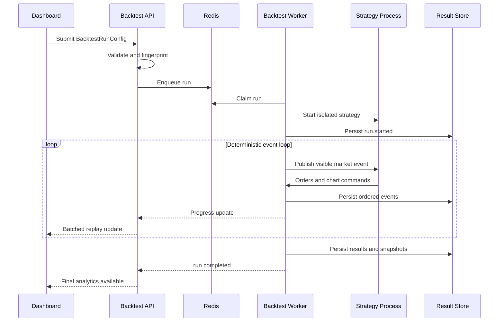

# Run Lifecycle

## Ordering Rule

A run-local event sequence defines exact replay order. Market event time defines chronology. Emission time is operational metadata and never decides simulation order.
