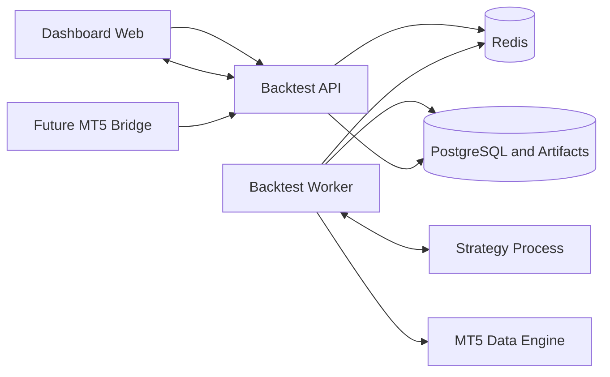
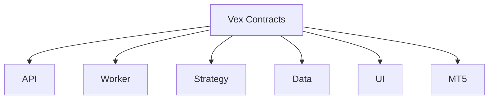

# System Context

## Contract Ownership

The contracts package contains transport and domain boundaries only. It does not contain database access, HTTP handlers, strategy logic, chart vendor adapters, or broker simulation behavior.
